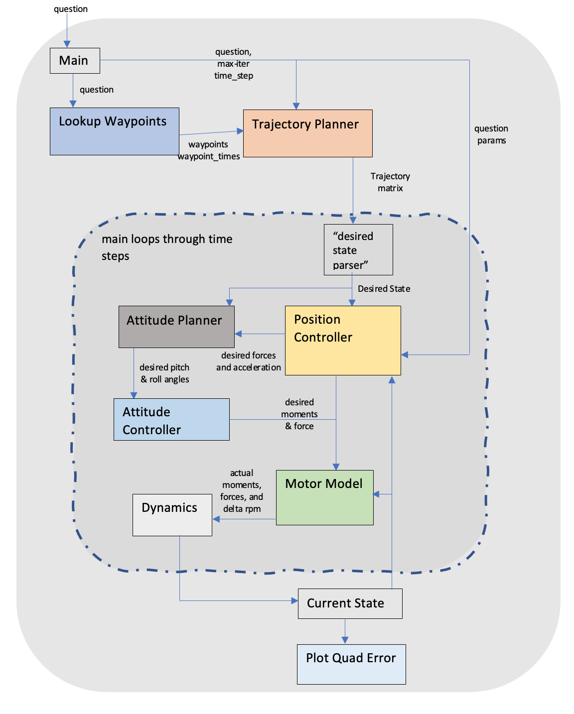

<!DOCTYPE html>
<html lang="en">
<head>
    <meta charset="UTF-8">
    
</head>
<body>
    <h1>Aerial Robot Trajectory Planning and Control</h1>
    <h2>Overview</h2>
    

        This repository hosts the implementation of an advanced control system for autonomous navigation of unmanned aerial vehicles (UAVs), specifically quadrotors. The project focuses on trajectory generation, position and attitude control, motor control, and state estimation. Utilizing principles from aerodynamics, rigid body dynamics, and control theory, the system enables precise maneuvering along predetermined paths.
    

    <h2>Control System Architecture</h2>
    

        The software pipeline incorporates multiple components to facilitate the complete simulation of the quadrotor platform. A detailed system diagram demonstrates the flow of data through various modules, from trajectory planning to dynamics modeling and feedback control.
    

    
    <h2>Key Algorithms and Mathematics</h2>
    

        The control system's design is founded on various mathematical models and algorithms, including:
    

    <ul>
        <li><strong>Rigid Body Dynamics:</strong> Governing the motion and orientation of the quadrotor using Euler's equations.</li>
        <li><strong>Aerodynamics:</strong> Accounting for forces such as lift, drag, and thrust, as well as the effects of blade flapping and ground effects.</li>
        <li><strong>Control Theory:</strong> Implementing PID controllers and estimators to manage system stability and response.</li>
        <li><strong>Motion Planning:</strong> Creating efficient trajectories that account for system limitations, such as motor rate constraints.</li>
    </ul>
    <h2>Implementation Details</h2>
    

        The MATLAB framework provided is used as a basis for implementing the stubs in various files, including but not limited to:
    

    <ul>
        <li>trajectory_planner.m</li>
        <li>position_controller.m</li>
        <li>attitude_planner.m</li>
        <li>attitude_controller.m</li>
        <li>motor_control.m</li>
    </ul>
    <h2>Testing Scenarios</h2>
    

    The control system includes various scenarios that simulate different aspects of the UAV's flight behavior. Each scenerio is hardcoded in waypoint_lookup.m as a specific set of instructions for the UAV to follow. The results of these scenarios can be visualized through plots generated by the system.
    

    <h3>Scenarios Description</h3>
    <ul>
        <li><strong>Senerio 1:</strong> Transitions the UAV between multiple waypoints along the x-axis at a fixed altitude, incrementing by 10 cm. Useful for observing hover stability and waypoint transition behavior.</li>
        <li><strong>Senerio 2:</strong> After commanding the robot to takeoff and hover, generate a command that tracks a single waypoint at [0, 0, 0.1] m (zero velocity).</li>
        <li><strong>Senerio 3:</strong> Directs the UAV to take-off, ascend to a height of 1.0 m, then descend back to the ground. This tests the UAV's line-tracking ability and response to incremental altitude changes.</li>
        <li><strong>Senerio 4:</strong> Showcases the UAV's capability to execute a more complex trajectory, including tracking to specific coordinates (2m, 1m, 2m) before returning.</li>
        <li><strong>Senerio 5.1:</strong> Simulates the UAV holding a position with a slight elevation and heading change. This is to observe the UAV's response to minor positional and orientation adjustments.</li>
        <li><strong>Senerio 5.2:</strong> Expands on the previous scenario by maintaining a specific orientation for a prolonged period, to assess the UAV's stability in holding angles.</li>
    </ul>
    <h2>Running the Simulation</h2>

    To run the quadrotor simulation, navigate to the MATLAB directory and execute the <code>main.m</code> script with the corresponding scenario number. Below are the different scenarios you can run, which correspond to various tasks that the UAV can perform:

<ul>
    <li><code>main(1)</code> - Transitions the UAV between multiple waypoints along the x-axis at a fixed altitude, incrementing by 10 cm.</li>
    <li><code>main(2)</code> - Commands the UAV to take off and hover, then generates a command to track a single waypoint at [0, 0, 0.1] m (zero velocity).</li>
    <li><code>main(3)</code> - Directs the UAV to take off, ascend to a height of 1.0 m, then descend back to the ground.</li>
    <li><code>main(4)</code> - Executes a more complex trajectory, tracking to specific coordinates (2m, 1m, 2m) before returning.</li>
    <li><code>main(5.1)</code> - Maintains a slight elevation and heading change to observe the UAV's stability.</li>
    <li><code>main(5.2)</code> - Maintains a specific orientation for a prolonged period to assess stability in holding angles.</li>
</ul>

    The results of these scenarios, including the UAV's behavior and any errors, can be visualized through the plots generated during the simulation.

    <h2>Feedback Loop and Control</h2>
    

        The feedback loop plays a critical role in maintaining the stability and accuracy of the UAV. The provided state diagram illustrates how the system state is used in conjunction with desired state information to calculate errors and adjust control inputs continuously.
    

    
</body>
</html>

